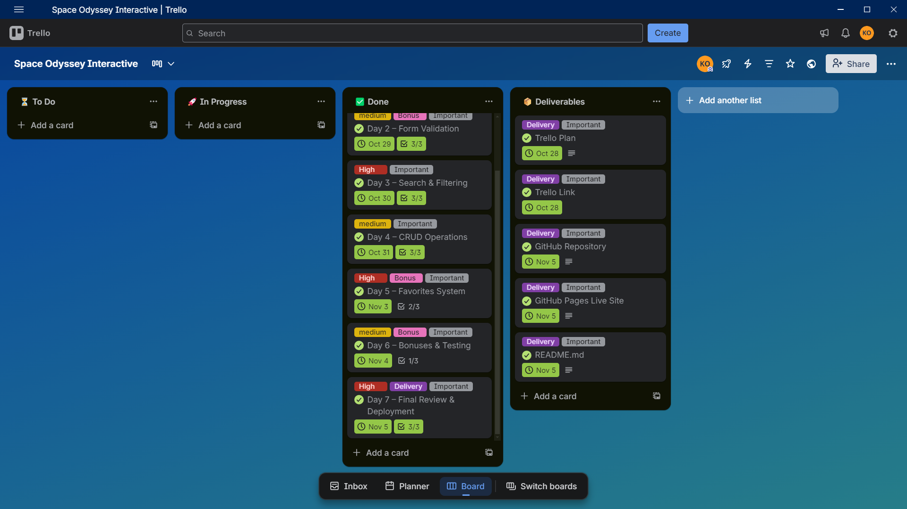

# Space Odyssey — By AstroTech Studio
An educational and interactive platform dedicated to space exploration and astronomy.  
Developed as part of the **Front-End JavaScript Enhancement** brief at AstroTech Studio.

---
## Table of Contents
- [Project Overview](#project-overview)
- [Educational Objectives](#educational-objectives)
- [Pages & Navigation](#pages--navigation)
- [Screenshots](#Screenshots)
- [Main Features (JavaScript)](#main-features-javascript)
- [Technologies Used](#technologies-used)
- [Development Workflow](#development-workflow)
- [Deployment](#deployment)
- [License](#license)
---

## Project Overview
**Space Odyssey** is a modern, interactive web application that brings the wonders of space to life.  
Starting from a static HTML/CSS foundation, this project enhances the site with **dynamic JavaScript features** to create an engaging, functional, and user-centric experience.

The focus is on **DOM manipulation**, **event handling**, **form validation**, **CRUD operations**, and **real-time filtering** — all without page reloads.

---
## Educational Objectives
- Master DOM manipulation and dynamic content rendering
- Implement full **CRUD** operations (Create, Read, Update, Delete) in the browser
- Build real-time search and multi-filter systems
- Create modal popups and interactive UI components
- Manage user data with arrays and event-driven updates
- Apply clean, readable, and maintainable JavaScript (ES6+)

---
## Pages & Navigation
The site features a **consistent header and navigation** across all pages:

| Page | Link | Description |
|------|------|-----------|
| **HOME** | `index.html` | Hero section, space facts, "What is Astronomy?", live space time counter |
| **ABOUT US** | `about.html` | Mission, team, and vision of Space Odyssey |
| **SPACE MISSIONS** | `missions.html` | **Interactive CRUD system** with filters, favorites, and modals |
| **PLANETS** | `plantes.html` | Educational content about solar system bodies |
| **CONTACT US** | `contact.html` | Contact form with validation |

**Global Features**:
- Language selector (English / Arabic / French)
- Search bar
- Favorites counter with popup
- User avatar
- Social media links (NASA Instagram & X)

---
## Screenshots

---
## Main Features (JavaScript)

### 1. **Full CRUD on Space Missions** (`missions.html`)
- **Add**: Modal form to create new mission
- **Read**: Dynamic card rendering
- **Update**: Edit modal with pre-filled data
- **Delete**: Confirmation popup before removal

### 2. **Advanced Search & Filtering**
- **Real-time search** by mission name
- **Agency filter** (e.g., select "NASA" → shows *all* NASA, NASA/ESA, etc.)
- **Year filter** (e.g., `1969`)
- **Combined filters** (search + agency + year)

### 3. **Favorites System**
- Heart button on each mission card
- Live counter in header
- Favorites popup with full mission details
- Toggle add/remove with instant UI update

### 4. **Interactive UI**
- Modal popups with overlay
- Smooth transitions and feedback
- No page reloads — all updates via DOM

---
## Technologies Used
### Front-End
- **HTML5** — Semantic, accessible structure
- **CSS3** — Flexbox, Grid, Mobile First, custom properties
- **JavaScript (Vanilla ES6)** — DOM, events, arrays, modals, filtering

### Tools
- **Git & GitHub** — Version control, branching, PRs
- **Live Server / Vercel** — Local dev and deployment
- **Figma** — Reference for layout and interactions

---
## Development Workflow
**Duration**: 7 days (Oct 28 – Nov 5, 2025)  
**Mode**: Individual  
**Process**:
1. Analyze static site and plan JS enhancements
2. Implement mission data structure (`data` array)
3. Build CRUD system with modals
4. Add filtering and search logic
5. Create favorites system with popup
6. Polish UX, test responsiveness
7. Deploy and document

---
## Deployment
**Live Site**: [https://space-odyssey-interactive.vercel.app](https://space-odyssey-interactive.vercel.app)  
**GitHub Repository**: [https://github.com/kara7z/Space-Odyssey-Interactive](https://github.com/kara7z/Space-Odyssey-Interactive)

Hosted on **Vercel** for fast, reliable static delivery.

---
## License
This project is for **educational purposes** under AstroTech Studio.  
© 2025 **Space Odyssey**. All rights reserved.

---
## Acknowledgments
Special thanks to the AstroTech Studio team and instructors for guidance on modern front-end practices.

---
**Explore. Discover. Dream.**  
*Space Odyssey — where curiosity meets the cosmos.*